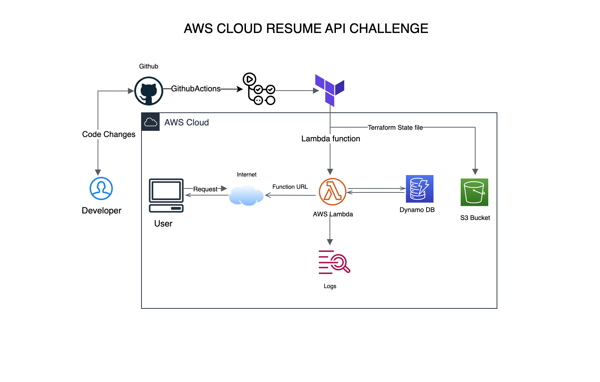
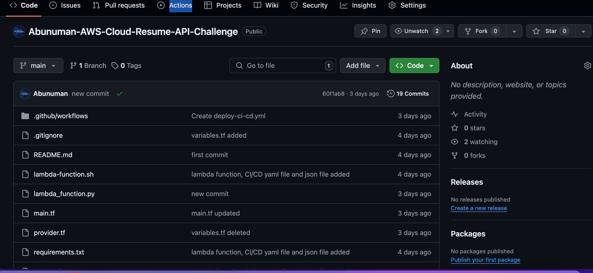
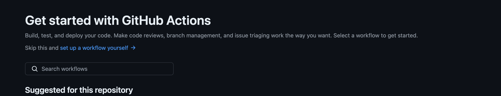
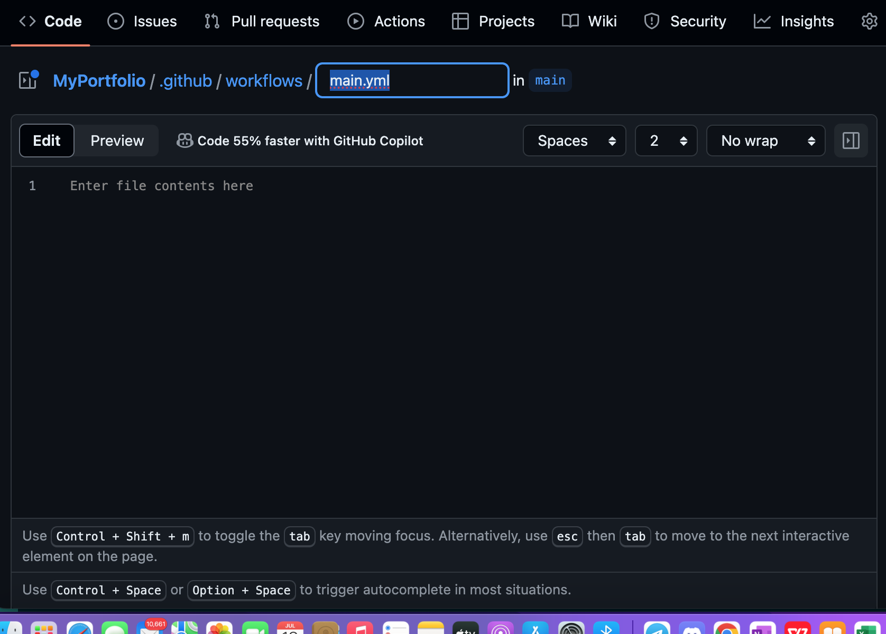

# Resume Fetcher API
This project sets up an AWS Lambda function that fetches resume data from a DynamoDB table and exposes it via a Function URL. The setup and deployment are managed using Terraform and GitHub Actions.

## Prerequisites
Before you start, make sure you have the following installed:

[X] AWS CLI

[X] Terraform

[X] Python 3.8+

[X] Pip

[X] An AWS account with necessary permissions

[X] GitHub account with access to create and use GitHub Actions
```
 project/
├── lambda_function.py
├── main.tf
├── provider.tf
├── requirements.txt
├── resume.json
└── package/
```
## Setup Instructions

1. #### Create a DynamoDB table and add the resume file in the table.

- Go to the AWS Console and search for DynamoDB.
- Click on Tables and create a table with a unique name in line with Resume e.g Resume_fetcher.

- Under the Key section pass in 'id' all lower case or uppercase and take note of the case.
- Do not give the item any value since we want to fetch the JSON data using resume id alone.
- Then pass the resume data in `resume.json` using the AWS CLI thus:

```
aws dynamodb put-item --table-name Resumes --item file://resume.json. --region us-east-1
```
- Replace --table-name "Resumes" with your table name and --region "us-east-1" with your region.

-Check the Table and you should have the resume data in the table.

2. #### Install Dependencies

Navigate to the project directory and install the dependencies listed in requirements.txt into the package directory.

```
pip install -r requirements.txt -t package/
```


3. #### Package the Lambda Function
Package the contents of the package directory along with your lambda_function.py file.

```
cd package
zip -r ../lambda_function.zip .
cd ..
zip -g lambda_function.zip lambda_function.py
```

You can also install the dependencies and package the lambda function using a shell script `lambda-function.sh` thus:

```
pip install -r requirements.txt -t package/
cd package
zip -r ../lambda_function.zip .
cd ..
zip -g lambda_function.zip lambda_function.py
```
Followed by granting the script executable permissions.

```
chmod +x lambda-function.sh
```

Then finally running the script

```
./lambda-function.sh
```

4. #### Terraform Configuration

a. Ensure your `main.tf` is correctly set up as provided in the code base.

b. Create an S3 bucket for terraform state files:

To monitor the state file of the terraform code as changes are being made.

#### Steps include:

Using the AWS console or AWS CLI

AWS Console:
- Search for S3 and click on it
- Click on Create Bucket and give your bucket a unique name
- While creating the bucket, ensure to ENABLE Bucket Versioning and click on create.

AWS CLI:

Run the following

`aws s3api create-bucket \
--bucket your-bucket-name \
--region your-region
--version enable`


Check the console. The bucket would have been created.

N.B: Ensure to configure the provider.tf as provided in the code base which included S3 bucket backend for the statefile.

Initialize and apply the Terraform configuration.

5. Running Terraform Commands
After creating the ZIP file and verifying its existence, you can proceed with running Terraform commands:

- Initialize Terraform:

```
terraform init
```

Plan the Deployment:

```
terraform plan
```
Apply Deployment
```
terraform apply

```
**Steps 2-5 can be skipped if you want to use a Continuous Integration/Continuous Deployment (CI/CD) tool to automate the processes such that by pushing your code changes to github, it gets picked up  immediately and deployed.**

I used **GitHub Actions** as my CI/CD tool.

6. #### Deploy Using GitHub Actions

Create a GitHub repository and push your project to it. 

Follow the following steps:

- Make sure your Github account has permissions to run Github actions. As soon as you open the project repository on github, you will notice `Action` as part of the options

 

- Click on it and click on setup your workflow yourself



This opens up a sample yaml file.

Delete it and add the yaml file in the .github/workflows/deploy-ci-cd.yml folder in the code base and you can leave it as main.yml or give it any name you wish that depicts your project idea.



7. Running the API
Once deployed, the API will be accessible via the Function URL. The URL will be provided as an output from the Terraform apply step.
You can also access the Function URL in the AWS console by:
- Clicking on Lambda.
- Then Functions. Under Functions, check for resume_checker (which is the name of our function). 
- There you have it! The Function URL labelled visibly.

8. Testing the API
a. Using Postman

- Open Postman.

- Create a new GET request.

- Enter the Function URL in the request URL. The URL will look like this:
```
https://{function-url}/resume/{id}

```
Replace {function-url} and {id} with the appropriate values.

- Click on the Send button.

- You should receive a response with the resume data in JSON format and a '200' response that shows the API is rendered.

b. Using Curl
You can also use curl to test the API.

```
curl -X GET "https://{function-url}/resume/{id}"
```
With that you have been able to complete the AWS Cloud Resume API Challenge.

## Cleaning Up
To clean up the resources created by Terraform, run:

```
terraform destroy

```
This will remove all AWS resources created by this project.

## Troubleshooting
If you encounter any issues, ensure that:

- Your AWS credentials are correctly configured.

- The lambda_function.zip file is correctly created and referenced.

- Terraform is properly initialized and configured.

Feel free to reach out with any questions or issues. Happy coding!

